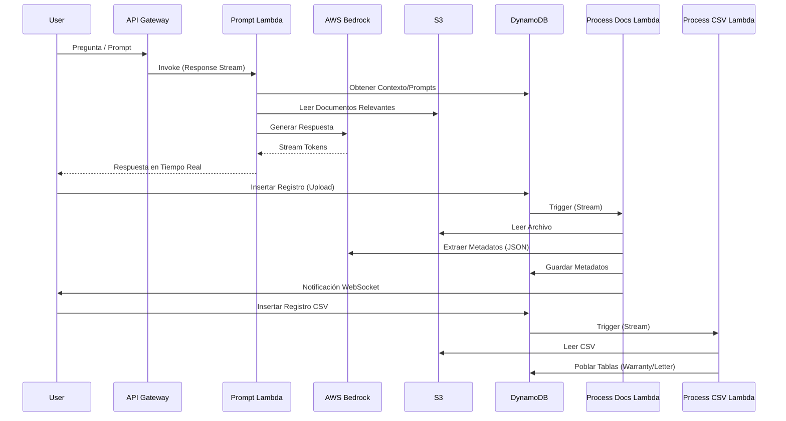

# Arquitectura Detallada: Inteligencia de Cumplimiento Regulatorio (Regulatory Compliance Intelligence)

Este documento describe la arquitectura del servicio **suptech-regulatory-compliance-intelligence-prompt**, un sistema centralizado de Inteligencia Artificial Generativa (GenAI) diseñado para asistir en la supervisión regulatoria mediante RAG (Retrieval-Augmented Generation), extracción de metadatos y procesamiento de documentos.

## 1. Visión General

Este servicio actúa como el "cerebro" de inteligencia artificial para la plataforma Suptech. No solo responde preguntas de los usuarios basándose en documentos, sino que también procesa archivos masivos (CSV) para alimentar otros motores de análisis (Garantías y Cartas Fianza) y genera documentos oficiales.

### Capacidades Principales
- **Asistente Conversacional (RAG)**: Responde preguntas sobre normatividad y documentos específicos utilizando AWS Bedrock.
- **Extracción de Metadatos**: Analiza documentos cargados (PDFs) para extraer información clave automáticamente.
- **Ingesta de Datos Regulatorios**: Procesa archivos CSV (Reportes Regulatorios y Tablas Internas) para poblar las bases de datos de análisis.
- **Generación de Documentos**: Convierte reportes en Markdown a documentos Word (.docx) oficiales.

## 2. Arquitectura del Sistema

El sistema utiliza una arquitectura **Serverless** pura sobre AWS, integrando fuertemente **DynamoDB Streams** para el procesamiento asíncrono y **AWS Bedrock** para las capacidades cognitivas.

### Diagrama de Flujo de Alto Nivel



## 3. Estructura del Proyecto

El proyecto es un monorepo SAM con múltiples funciones Lambda especializadas.

```
suptech-regulatory-compliance-intelligence-prompt/
├── functions/
│   ├── regulatory-compliance-prompt/   # [Lambda] Chatbot RAG principal
│   ├── process-documents/              # [Lambda] Extracción de metadatos (Docker)
│   ├── process-csv-documents/          # [Lambda] Ingesta de CSVs regulatorios
│   ├── generate-warranty-document/     # [Lambda] Generador Markdown -> Word
│   ├── document-highlight/             # [Lambda] Visualización de PDFs con contexto
│   └── get-documents-analysis-sheet/   # [Lambda] Descarga de hojas de análisis
├── infrastructure/                     # Definición OpenAPI
├── template.yaml                       # Infraestructura SAM
└── samconfig.toml                      # Configuración de despliegue
```

## 4. Componentes Principales (Lambdas)

### 4.1. Regulatory Compliance Prompt (`functions/regulatory-compliance-prompt`)
**Trigger**: Function URL (Response Stream)
**Runtime**: Node.js 22.x

Es el núcleo conversacional. Utiliza `BedrockAIChatClient` para interactuar con modelos fundacionales (Claude, Titan, etc.).
- **Gestión de Contexto**: Recupera prompts del sistema desde DynamoDB (`PromptsTableName`).
- **Acceso a Archivos**: Puede leer documentos de análisis de garantías y cartas fianza desde S3 para responder preguntas sobre casos específicos.
- **Streaming**: Devuelve la respuesta token por token para mejorar la UX.

### 4.2. Process Documents (`functions/process-documents`)
**Trigger**: DynamoDB Stream (`INSERT`)
**Runtime**: Docker Image (Node.js)

Se activa automáticamente cuando se sube un nuevo documento al sistema.
- **Lógica**: Descarga el archivo, y usa un prompt específico (`PromptType.METADATA`) para pedirle a la IA que extraiga campos clave en formato JSON.
- **Salida**: Guarda los metadatos extraídos en `SupervisoryRecordsMetadataTableName`.

```typescript
// Ejemplo de Prompt de Sistema para Metadatos
const prompt = 'Debes responder con una cadena JSON válida... {"metadata": {...}, "recordId": "..."}';
```

### 4.3. Process CSV Documents (`functions/process-csv-documents`)
**Trigger**: DynamoDB Stream (`INSERT`)
**Runtime**: Node.js 22.x

Maneja la carga masiva de datos estructurados. Clasifica y procesa cuatro tipos de archivos CSV:
1. **WARRANTY_REGULATORY**: Reportes regulatorios de garantías.
2. **WARRANTY_INTERNAL**: Tablas internas de garantías.
3. **LETTER_REGULATORY**: Reportes regulatorios de cartas fianza.
4. **LETTER_INTERNAL**: Tablas internas de cartas fianza.

Utiliza procesadores específicos (`WarrantyRegulatoryReportsProcessor`, etc.) para parsear el CSV e insertar los registros en las tablas DynamoDB correspondientes que luego consumen los motores de análisis.

### 4.4. Generate Warranty Document (`functions/generate-warranty-document`)
**Trigger**: Function URL
**Runtime**: Node.js 22.x

Microservicio utilitario que recibe contenido en formato Markdown y devuelve un archivo binario `.docx` (Word). Es utilizado para exportar los informes generados por la IA en un formato editable y oficial.

## 5. Integración de Datos

El servicio actúa como un hub de integración:

- **Entrada**: Recibe documentos (PDF, Excel) y datos estructurados (CSV).
- **Procesamiento**:
    - **OCR/Texto**: Extrae texto de documentos para RAG.
    - **Semántico**: Usa Bedrock para entender el contenido.
    - **Estructurado**: Convierte CSVs en registros de base de datos.
- **Salida**:
    - **Respuestas de Chat**: Texto natural.
    - **Metadatos**: JSON estructurado.
    - **Tablas de Análisis**: Datos listos para los motores de reglas (Python).
    - **Documentos**: Archivos Word.

## 6. Infraestructura AWS (SAM)

El `template.yaml` define una infraestructura compleja:

- **DynamoDB Tables**:
    - `RegulatoryCompliancePromptsTable`: Almacena los prompts del sistema versionados.
    - Tablas de registros y metadatos (referenciadas por nombre).
- **S3 Buckets**:
    - Buckets para CSVs, registros procesados y reportes.
- **IAM Roles**:
    - Permisos granulares para que cada Lambda acceda solo a sus recursos (Bedrock, S3, DynamoDB).
- **Docker**:
    - `ProcessDocumentsFunction` se despliega como imagen de contenedor debido a dependencias pesadas (posiblemente herramientas de procesamiento de PDF/OCR).

## 7. Stack Tecnológico

| Componente | Tecnología | Uso |
|------------|------------|-----|
| **IA Generativa** | AWS Bedrock | Modelos de lenguaje (Claude/Titan) |
| **Runtime** | Node.js 22.x | Lógica de negocio |
| **Contenedores** | Docker | Procesamiento pesado de documentos |
| **Base de Datos** | DynamoDB | NoSQL para metadatos y eventos |
| **Colas** | SQS | Notificaciones WebSocket |
| **Almacenamiento** | S3 | Persistencia de archivos |
| **IaC** | AWS SAM | Despliegue de infraestructura |

## 8. Configuración y Despliegue

### Variables de Entorno Clave
- `BEDROCK_MODEL_ID`: Identificador del modelo a usar (ej. `anthropic.claude-3-sonnet...`).
- `SYSTEM_PROMPTS_TABLE_NAME`: Tabla de prompts.
- `SAVE_CSV_FLAG`: Feature flag para guardar CSVs intermedios.

### Scripts de Despliegue
El repositorio incluye scripts de PowerShell (`deploy-cloudformation-qa.ps1`) que automatizan el empaquetado y despliegue usando SAM CLI, gestionando los parámetros de configuración para el entorno de QA.
